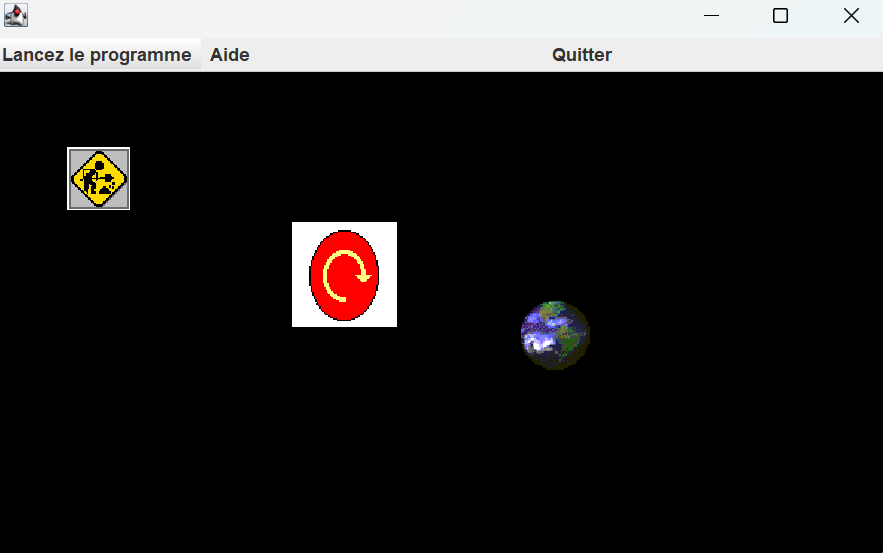

# JavaThread_PracticalWork

Ce projet Java a été réalisé dans un cadre académique afin d’explorer le **multithreading** et l’interface graphique en **Swing**.

Il propose une interface permettant de lancer, stopper ou interagir avec trois petites animations indépendantes, chacune gérée par un **thread dédié**.

---

## ⚙️ Fonctionnement

L’interface graphique (via `JFrame` + `JPanel`) permet :

- d’afficher 3 séries d’images différentes :
  - 👷 "Builder Sign" 
  - 🔁 "Loop Panel"
  - 🌍 "Earth Picture"
- de **lancer chaque animation** via un thread (`Thread.sleep` + `repaint`)
- de **stopper chaque animation individuellement**
- pour l’image du "Builder", si le thread est arrêté :
  - un **clic manuel** fait passer à l’image suivante
  - un **son de chat** (`catyell.wav`) est joué à chaque clic

Les animations sont gérées par trois classes Java :
- `thread_construct`
- `thread_loop`
- `thread_earth`

## 🚀 Lancer le projet

### 🧰 Prérequis

- **Java SDK / JRE** : Java **17** (JavaSE-17)
  - Compiler compliance level : `17`
  - JRE System Library : `JavaSE-17`
- **IDE recommandé** : Eclipse IDE for Java Developers
  - Version testée : *2022-06 (4.24.0)*
  - Build ID : *20220609-1112*
- **Bibliothèques utilisées** :
  - `javax.swing.*`, `java.awt.*` pour l’IHM
  - `java.io.*`, `javax.sound.sampled.*` pour le son

> ⚠️ Swing peut présenter des problèmes avec certaines versions de JDK récentes. Le projet a été testé et fonctionne sous **Java 17**.

### 🚀 Eclipse (ou autre IDE)

1. Ouvrir le dossier `TP2` dans Eclipse
2. Vérifier que le SDK Java 17 est bien configuré (Build Path)
3. Lancer la classe `classJframe.java` (clic droit > Run As → Java Application)

## 📷 Aperçu

